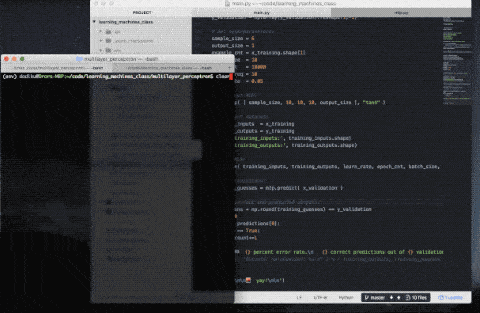

# Multilayer Perceptron

#### Training setup:
|Setting|Description|
|---|---|
|Dataset|[Car Evaluation Data Set](http://archive.ics.uci.edu/ml/datasets/Car+Evaluation)|
|Number of inputs|6|
|Number of hidden neurons|10|
|Number of hidden layers|3|
|Number of outputs|1|

> Multilayer Perceptron code by [@Hebali](https://github.com/Hebali)
