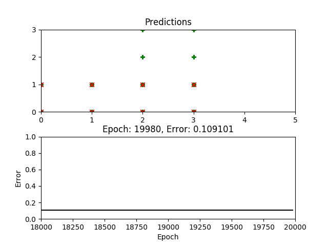

# Multilayer Perceptron

> Multilayer Perceptron code (``mlp.py``) by [@Hebali](https://github.com/Hebali)

#### 🏅  Best training results:
|Setting|Description|
|---|---|
|Dataset|[Car Evaluation Data Set](http://archive.ics.uci.edu/ml/datasets/Car+Evaluation)|
|Number of inputs|6|
|Number of hidden layers|9|
|Number of hidden neurons|[6, 6, 6, 6, 6, 6, 6, 6, 6|
|Number of outputs|1|
|Batch size|4|
|Epochs|20,000|
|Learn rate|0.02|
|Error rate after training|0.109101|
|**Prediction success rate**|**91.435%**|

##### 🥈  Second best training results:
|Setting|Description|
|---|---|
|Dataset|[Car Evaluation Data Set](http://archive.ics.uci.edu/ml/datasets/Car+Evaluation)|
|Number of inputs|6|
|Number of hidden layers|3|
|Number of hidden neurons|8,12,8|
|Number of outputs|1|
|Batch size|4|
|Epochs|10,000|
|Learn rate|0.05|
|Error rate after training|0.109606|
|**Prediction success rate**|**91.435%**|
