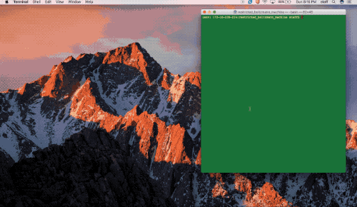
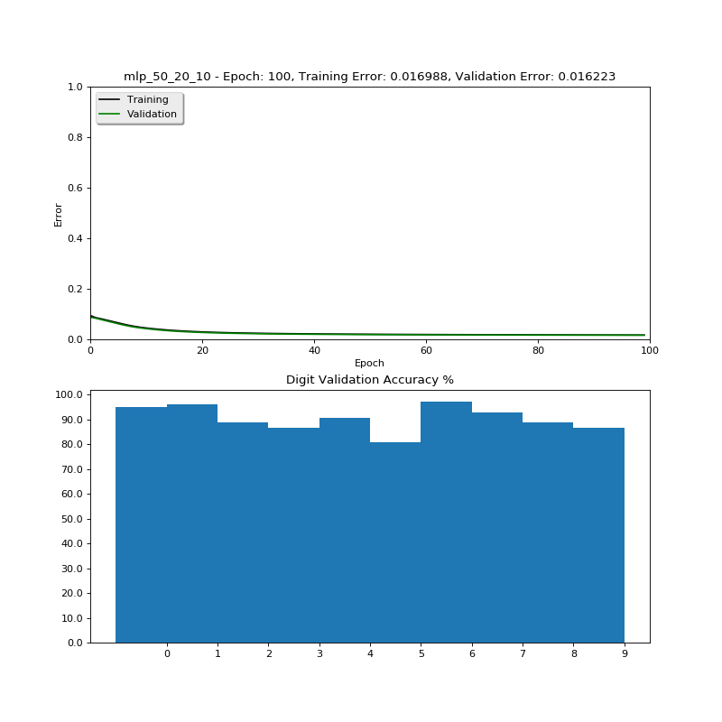
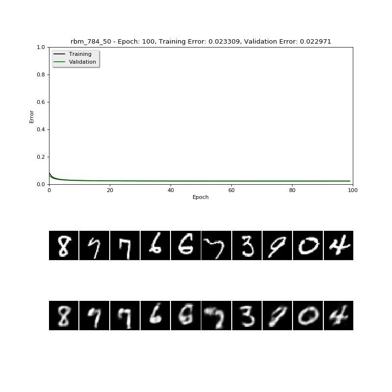

# Multilayer Perceptron

> Restricted Boltzmann Machine code by [@Hebali](https://github.com/Hebali) at [The Great Hyperparameter Hunt](https://github.com/Hebali/learning_machines/tree/master/hyperparameter_hunt)

#### 🏅  Best training results:
|Setting|Description|
|---|---|
|Dataset|MNIST|
|mnist_use_threshold|?|
|rbm_is_continuous|?|
|rbm_visible_size|?|
|rbm_batch_size|?|
|rbm_learn_rate|?|
|rbm_cd_steps|?|
|rbm_training_epochs|?|
|rbm_report_freq|?|
|mlp_layer_sizes|?|
|mlp_batch_size|?|
|mlp_learn_rate|?|
|mlp_training_epochs|?|
|**Error rate**|**??%**|
|**Accuracy**|**??%**|

