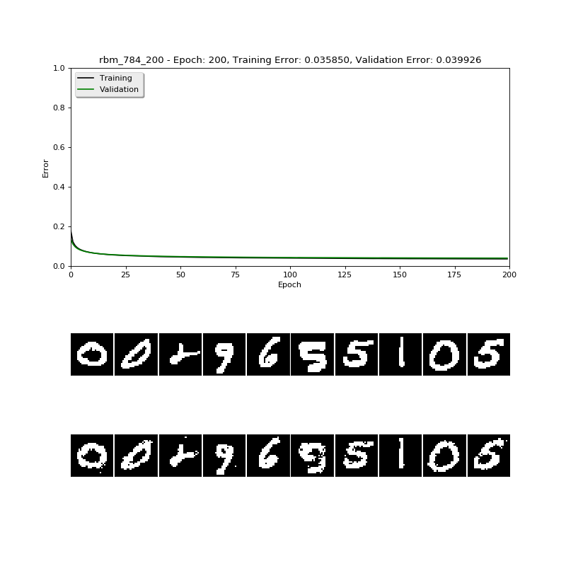
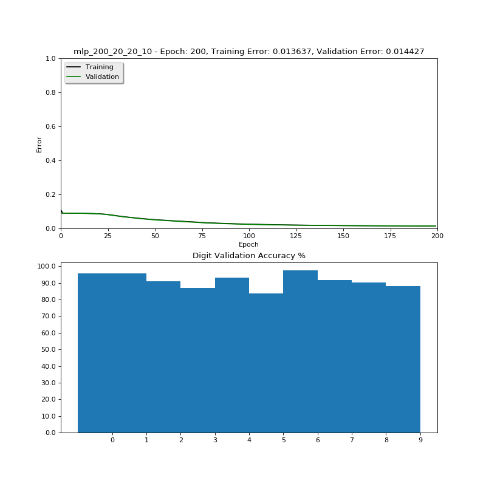

# Multilayer Perceptron

> Restricted Boltzmann Machine code by [@Hebali](https://github.com/Hebali) at [The Great Hyperparameter Hunt](https://github.com/Hebali/learning_machines/tree/master/hyperparameter_hunt)

#### 🏅  Best training results:
|Setting|Description|
|---|---|
|Dataset|MNIST|
|mnist_use_threshold|True|
|rbm_is_continuous|False|
|rbm_visible_size|784|
|rbm_hidden_size|200|
|rbm_batch_size|20|
|rbm_learn_rate|0.02|
|rbm_cd_steps|1|
|rbm_training_epochs|200|
|rbm_report_freq|1|
|mlp_layer_sizes|[200, 20, 20, 10]|
|mlp_batch_size|20|
|mlp_learn_rate|0.03|
|mlp_training_epochs|200|
|**Error rate**|**1.4883%**|
|**Accuracy**|**91.0600%**|

